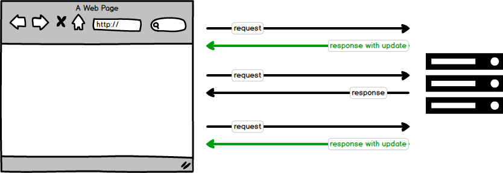
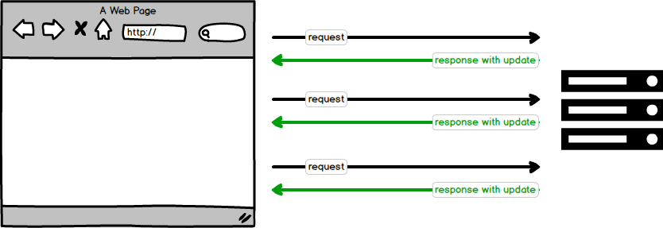
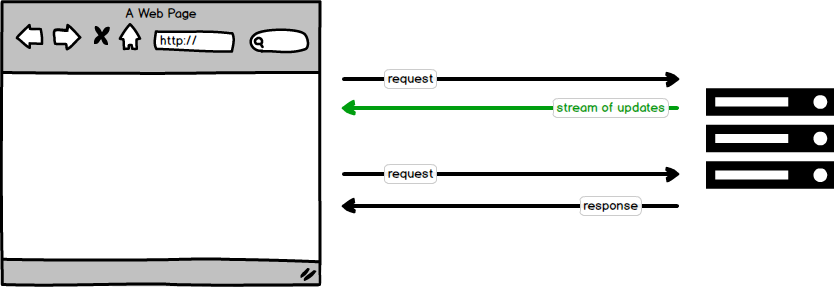
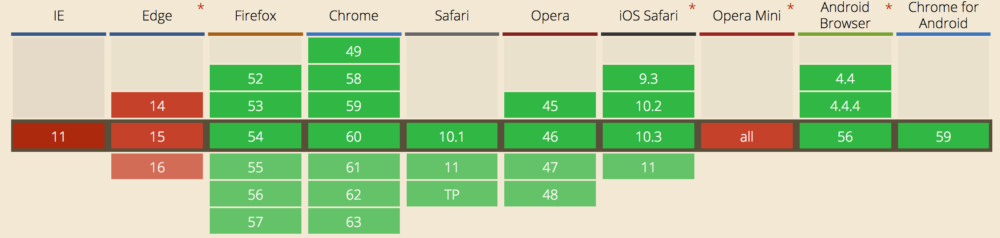
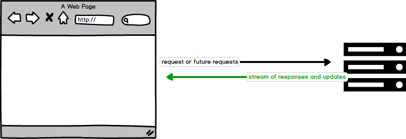
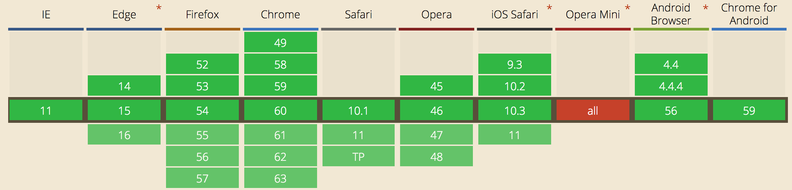
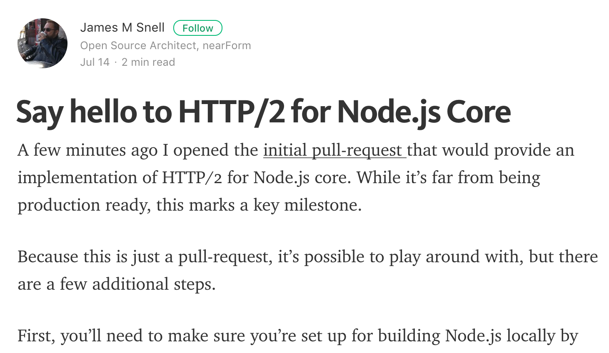
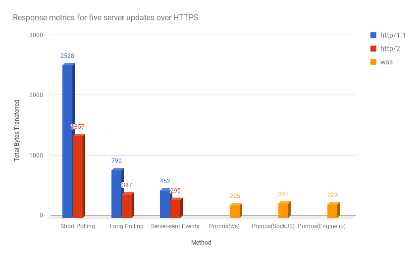

title: "Real-time Web: A comparison of methods"
author:
    name: Alexis Abril
    twitter: "@alexisabril"
    url: https://aquil.io
output: slides.html
theme: sudodoki/reveal-cleaver-theme

--

# Real-time Web
## A comparison of methods

--

### Methods

- Short-polling
- Long-polling
- Server-sent events
- WebSockets

--

### Short-polling

--

### Long-polling

--

### Server-sent events

--

### Server-sent events

--

### WebSockets

--

### WebSockets

--

### The test

Create an application that receives 5 updates from the server, recording
bytes transferred to achieve "real-time" functionality.

--

## http/2

--

--

## The results

--

--

### Takeaways

- Main benefit of http/2 in this experiment is header compression
- http/2 multiplexing benefits in the case of parallel client requests
- WebSockets offer full duplex data transfer
